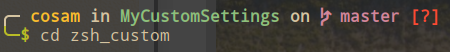

# My zsh setups
> Based on [oh-my-zsh](https://github.com/robbyrussell/oh-my-zsh)

This folder is the `$ZSH_CUSTOM` of `oh-my-zsh`.

 `.zshrc` file is used the default one with cumstom it. custom theme [spaceshipZSH](https://github.com/denysdovhan/spaceship-prompt) is used to custom.

 ```bash
 git clone https://github.com/denysdovhan/spaceship-prompt.git "$ZSH_CUSTOM/themes/spaceship-prompt"
 ```

```bash
ln -s "$ZSH_CUSTOM/themes/spaceship-prompt/spaceship.zsh-theme" "$ZSH_CUSTOM/themes/spaceship.zsh-theme"
``` 
 
 The `spaceship.zsh` file should be settled in the `"spaceship-prompt"` dir.



